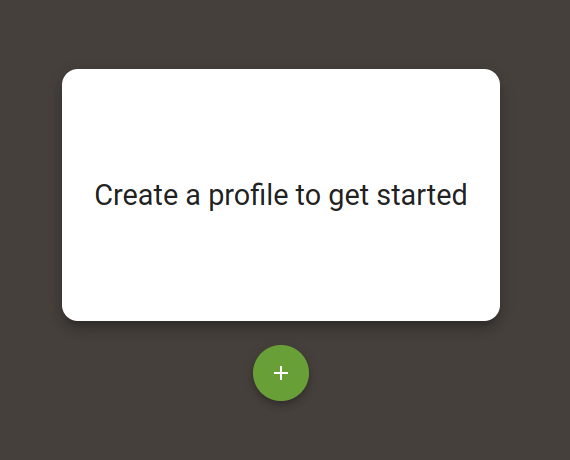
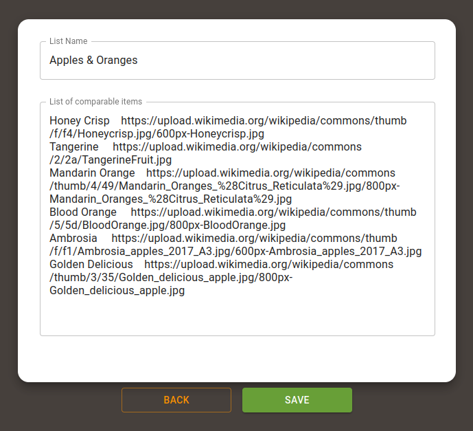
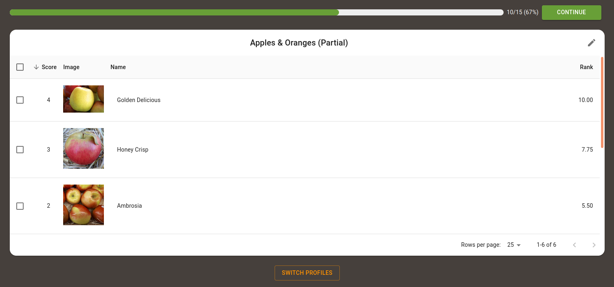
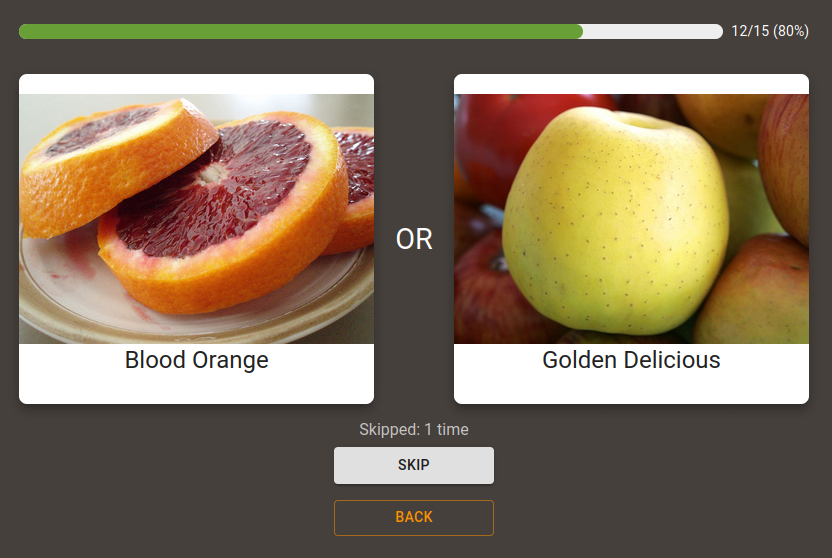
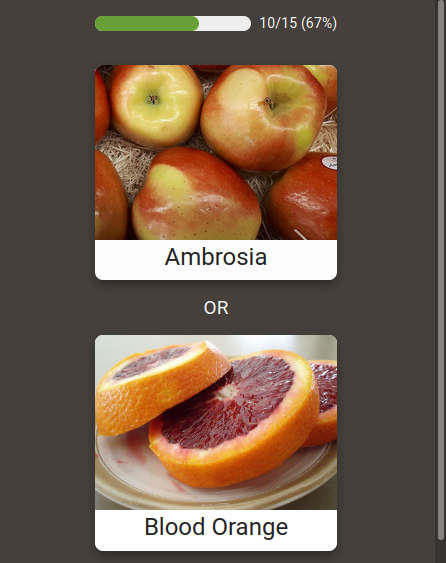
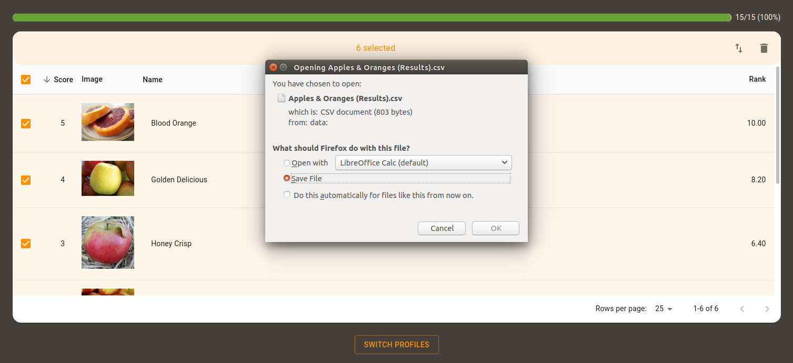
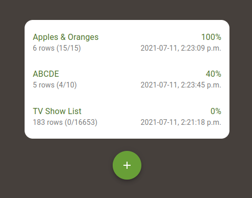
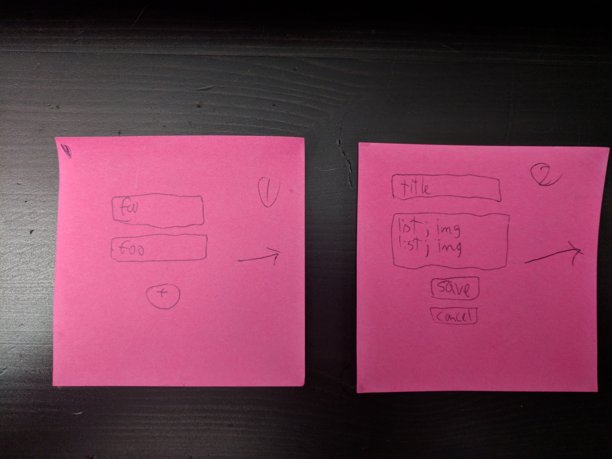
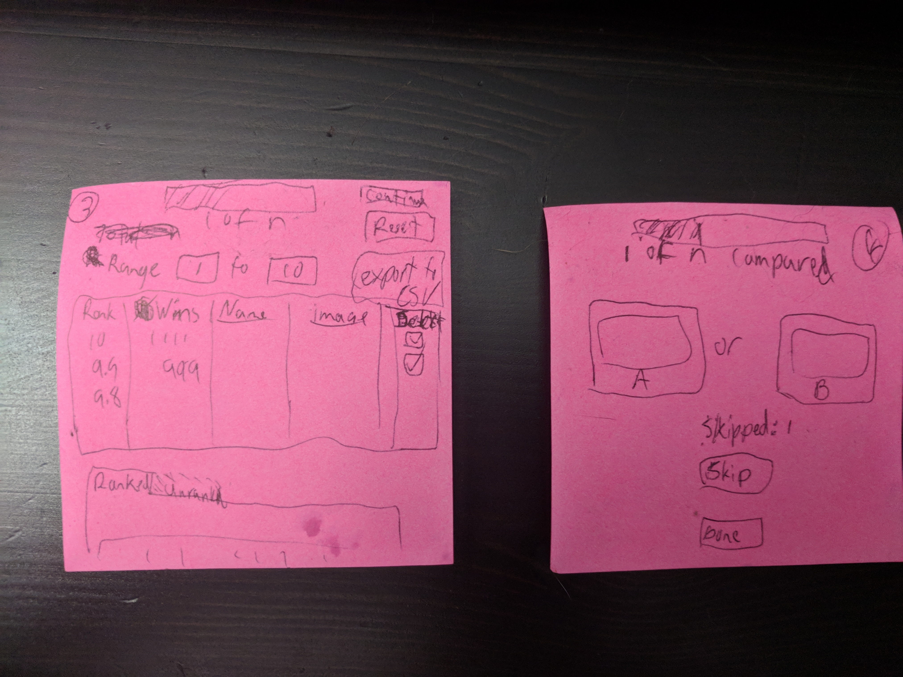

# Pairwise Ranking Web App
[  Click here to see a demo.](https://iamovrhere.github.io/pairwise-ranking-app/) (localStorage doesn't work on large sets yet)

Icon modified from [OpenMoji Project (author Marius Schnabel)]( https://openmoji.org/library/#search=pear&emoji=1F350).

## Background
["Pairwise Ranking" (wikipedia)](https://en.wikipedia.org/wiki/Pairwise_comparison) (sometimes called "Preference Ranking"), can be best described as taking a "divide and conquer" approach to prioritizing/ranking a set.

In it we expand the comparisons into a every possible combination of 2, compare a pair, assign one a winner, and repeat. After we've assigned every possible pair a winner, we will have an aggregate of winners, where repeated winners gravitate to the top and losers to the bottom.

> L. L. Thurstone first introduced a scientific approach to using pairwise comparisons for measurement in 1927, which he referred to as the law of comparative judgment.

This is intended as a simple web app to aggregate a preference list from input (using local storage to start), by simplifying to a simple A or B choice. The expected audience (aside from just myself), is someone with _minor_ technical understanding.

## Screenshots

<details open>
  <summary>Click to expand/collapse</summary>

Overview of app:









</details>

### Planning

<details close>
  <summary>Click to expand/collapse</summary>

Quick 30 second wire-frames for direction:



Screen 3 does need some refinement of when/where to have buttons.

</details>

## Requirements

* **Recommended:** Node 14 (via [nvm](https://github.com/nvm-sh/nvm#installing-and-updating))
* yarn - [Install yarn](https://classic.yarnpkg.com/en/docs/install/#debian-stable)

## Setup

This was bootstrapped using `yarn create react-app pairwise-ranking-app`. See [Create React App](https://github.com/facebook/create-react-app).

1. yarn install
1. Done

### Available Scripts

In the project directory, you can run:

#### `yarn start`

Runs the app in the development mode.

Open [http://localhost:3000](http://localhost:3000) to view it in the browser.

The page will reload if you make edits. You will also see any lint errors in the console.

#####  Error: `System limit for number of file watchers reached`

```bash
Internal watch failed: ENOSPC: System limit for number of file Error: ENOSPC: System limit for number of file watchers reached, watch '/path/path/path/repos/pairwise-ranking-app/public'
...
errno: -28,
syscall: 'watch',
code: 'ENOSPC',
path: '/path/path/path/repos/pairwise-ranking-app/public',
filename: '/path/path/path/repos/pairwise-ranking-app/public'
}
```

Sometimes happens on linux (in general) for Node scripts of this nature, Either:

```bash
sudo sysctl -w fs.inotify.max_user_watches=100000
```

Or edit `/etc/sysctl.d/10-user-watches.conf` with:
```ini
fs.inotify.max_user_watches = 100000
```

#### `yarn test`

**(None done yet).**

Launches the test runner in the interactive watch mode.

See the section about [running tests](https://facebook.github.io/create-react-app/docs/running-tests) for more information.

#### `yarn build`

Usage:
```
PUBLIC_URL="/public_html/pairwise-ranking-app/" yarn build
```

Builds the app for production to the `build` folder. Provides the commit hash on the page.

It correctly bundles React in production mode and optimizes the build for the best performance. You need to set `PUBLIC_URL` if you want a non-root path.

See the section about [deployment](https://facebook.github.io/create-react-app/docs/deployment) for more information.

#### `yarn deploy-to-github`

Usage:
```bash
# Only builds and copies.
yarn deploy-to-github
# Builds, copies, commits.
yarn deploy-to-github "[Mod]: Publishing change to iamovrhere.github.io"
```

Builds & commits changes to:
* https://github.com/iamovrhere/iamovrhere.github.io

To demo/use here:
* https://iamovrhere.github.io/pairwise-ranking-app/

## TODOs

- [x] Style out the build info
- [x] Set material UI colour theme
- [ ] Perhaps either setup some backend (meeeh) or an export/import ranking.
- [ ] Replace localStorage with IndexDB - https://developer.mozilla.org/en-US/docs/Web/API/IndexedDB_API/Using_IndexedDB
- [ ] RESPONSIVE - Tinker with the mobile/tablet/desktop profiles
    - I will likely most use this with tablet/mobile.
- [ ] Convert into TypeScript
    - Should I bother?
- [ ] Tests for contexts/reducers
- [ ] Router Transitions http://maisano.github.io/react-router-transition/getting-started / https://www.npmjs.com/package/react-router-transition / https://reactrouter.com/web/example/animated-transitions
- [ ] TRANSLATIONS - Add translations (probably last since this is primary for my use)

Below this is stock README
---


### Code Splitting

This section has moved here: [https://facebook.github.io/create-react-app/docs/code-splitting](https://facebook.github.io/create-react-app/docs/code-splitting)

### Analyzing the Bundle Size

This section has moved here: [https://facebook.github.io/create-react-app/docs/analyzing-the-bundle-size](https://facebook.github.io/create-react-app/docs/analyzing-the-bundle-size)

### Making a Progressive Web App

This section has moved here: [https://facebook.github.io/create-react-app/docs/making-a-progressive-web-app](https://facebook.github.io/create-react-app/docs/making-a-progressive-web-app)

### Advanced Configuration

This section has moved here: [https://facebook.github.io/create-react-app/docs/advanced-configuration](https://facebook.github.io/create-react-app/docs/advanced-configuration)


